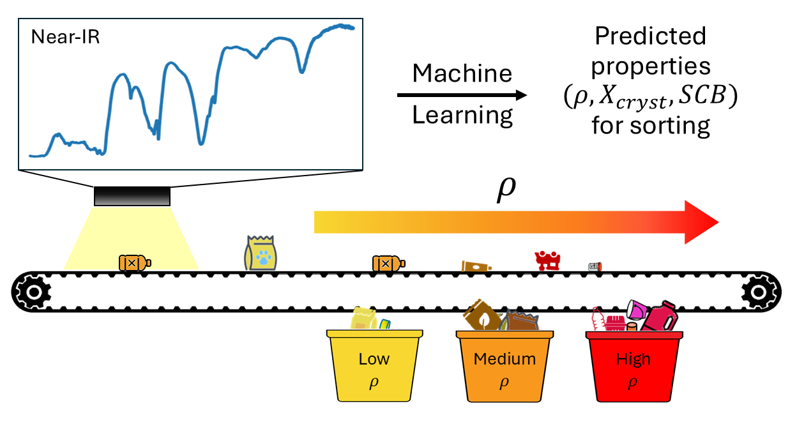

## Concept

*Illustration of predicting polyolefin properties (density, crystallinity, SCB) from NIR spectra using machine learning for improved sorting.*

# nir-polyolefin-property-prediction
Machine learning prediction of polyolefin properties from NIR spectra for improved plastic sorting and recycling

## License

This project is based on software developed by the National Institute of Standards and Technology (NIST).  
See the LICENSE file for details.
